# 🏠 Blockchain-Based Land Registry & Property Ownership System


A blockchain-based **Land Registry and Property Ownership Management System** developed using **Solidity, Ethereum, Hardhat, JavaScript, and SHA-256 hashing**.

The project demonstrates how blockchain technology can be used to create a transparent and tamper-resistant system for registering properties, verifying property documents, maintaining ownership records, and securely transferring property ownership.

---

## 📌 Table of Contents

- [Project Overview](#-project-overview)
- [Problem Statement](#-problem-statement)
- [Proposed Solution](#-proposed-solution)
- [Key Features](#-key-features)
- [System Architecture](#-system-architecture)
- [Technology Stack](#-technology-stack)
- [Project Structure](#-project-structure)
- [Smart Contract Functions](#-smart-contract-functions)
- [SHA-256 Document Verification](#-sha-256-document-verification)
- [Security Testing](#-security-testing)
- [Screenshots](#-screenshots)
- [Installation](#-installation)
- [Compile the Contract](#-compile-the-contract)
- [Run Automated Tests](#-run-automated-tests)
- [Remix IDE Testing](#-remix-ide-testing)
- [Future Scope](#-future-scope)
- [Author](#-author)

---

## 🚀 Project Overview

Traditional land registry systems rely heavily on centralized databases, paperwork, and manual verification.

This project explores the use of **blockchain technology** for managing land/property ownership records.

Property information is managed through an Ethereum smart contract, while a **SHA-256 hash** of the corresponding property document can be stored for document-integrity verification.

The system demonstrates:

- Property registration
- Property information retrieval
- Ownership management
- Ownership transfer
- Document hash storage
- Document-integrity verification
- Administrator access control
- Unauthorized-operation rejection
- Automated smart-contract testing

---

## ❗ Problem Statement

Traditional property registration systems may face problems such as:

- Manual paperwork
- Slow verification
- Centralized record management
- Difficulty verifying document integrity
- Unauthorized modification risks
- Complex ownership-history verification

A blockchain-based implementation can demonstrate how immutable transaction records and cryptographic hashes may improve transparency and integrity.

---

## 💡 Proposed Solution

The proposed system uses an **Ethereum smart contract** to manage property records.

Each property is associated with information such as:

- Property ID
- Property number
- Location/details
- Property area
- Owner
- Document hash
- Registration information

A **SHA-256 hash** generated from the property document is used as a digital fingerprint.

If the document changes, its SHA-256 hash also changes, allowing document modifications to be detected.

---

## ✨ Key Features

### 🏠 Property Registration

Authorized administrator accounts can register new properties on the blockchain.

### 👤 Ownership Management

Every registered property is associated with an Ethereum address representing its owner.

### 🔄 Ownership Transfer

Property ownership can be transferred from the existing owner to another Ethereum address.

### 🔐 Access Control

Administrative operations are protected so unauthorized accounts cannot perform restricted actions.

### 📄 Document Integrity Verification

Property documents are hashed using **SHA-256**.

The generated hash can be compared with the hash stored in the blockchain record.

### 🛡️ Duplicate Registration Protection

The smart contract prevents the same property from being registered multiple times.

### 📜 Ownership History

Ownership changes can be tracked through the smart contract/system records.

### 🧪 Automated Testing

Hardhat tests are included to verify important smart-contract operations and security conditions.

---

# 🏗️ System Architecture

```text
                    PROPERTY DOCUMENT
                           │
                           ▼
                    SHA-256 HASHING
                           │
                           ▼
                    DOCUMENT HASH
                           │
                           ▼
USER / ADMIN ─────► SMART CONTRACT
                           │
                           ▼
                  ETHEREUM BLOCKCHAIN
                           │
              ┌────────────┼────────────┐
              ▼            ▼            ▼
          PROPERTY      OWNERSHIP     DOCUMENT
           RECORD        RECORD         HASH
```

### Basic Workflow

```text
Administrator
     │
     ▼
Register Property
     │
     ▼
Store Property Details + SHA-256 Hash
     │
     ▼
Blockchain Record
     │
     ├────► Verify Property
     │
     ├────► Verify Document Hash
     │
     ├────► Transfer Ownership
     │
     └────► View Ownership Information
```

---

# 🛠️ Technology Stack

| Technology | Purpose |
|---|---|
| Solidity | Smart-contract development |
| Ethereum | Blockchain platform |
| Remix IDE | Manual smart-contract deployment/testing |
| Hardhat | Local development and automated testing |
| JavaScript | Deployment and test scripts |
| Node.js | JavaScript runtime |
| npm | Dependency management |
| SHA-256 | Property-document integrity |
| PowerShell | Local commands and hash generation |
| Git | Version control |
| GitHub | Source-code hosting and project documentation |

---

# 📂 Project Structure

```text
Blockchain-Land-Registry-Property-Ownership/
│
├── contracts/
│   └── LandRegistry.sol
│
├── hashes/
│   └── property_001_hash.txt
│
├── sample_documents/
│   └── property_001.json
│
├── screenshots/
│   ├── 01-contract-compilation.png
│   ├── 02-contract-deployment-admin.png
│   ├── 03-property-registration.png
│   ├── 04-duplicate-property-rejected.png
│   ├── 05-unauthorized-registration-rejected.png
│   ├── 06-property-verification.png
│   ├── 07-unauthorized-verification-rejected.png
│   ├── 08-ownership-transfer.png
│   ├── 09-new-owner-confirmed.png
│   ├── 10-old-owner-transfer-rejected.png
│   ├── 11-ownership-history.png
│   ├── 12-owner.png
│   ├── 13-original-hash.png
│   ├── 14-real-hash-on-blockchain.png
│   ├── 15-hardhat-compilation.png
│   ├── 16-hardhat-deployment.png
│   └── 17-hardhat-test-automated.png
│
├── scripts/
│   └── deploy.js
│
├── test/
│   └── LandRegistry.test.js
│
├── .gitignore
├── hardhat.config.js
├── package.json
├── package-lock.json
└── README.md
```

---

# 📜 Smart Contract Functions

The `LandRegistry.sol` smart contract handles the core blockchain operations.

The implementation demonstrates functions for operations such as:

```text
registerProperty()
getProperty()
verifyProperty()
transferOwnership()
getOwner()
getOwnershipHistory()
```

> Function names and parameters should be checked against the current `LandRegistry.sol` implementation if the contract is modified.

---

# 🔑 SHA-256 Document Verification

One of the main security demonstrations in this project is property-document integrity verification.

For example:

```text
property_001.json
       │
       ▼
 SHA-256 Algorithm
       │
       ▼
E1B0C4809C68FD9671F139A5279EB928D5EF4CDE23FE4E102594CA27E6764934
```

The generated hash is stored separately and can also be associated with the blockchain property record.

### Generate SHA-256 Hash on Windows

Open PowerShell inside the `sample_documents` directory:

```powershell
Get-FileHash ".\property_001.json" -Algorithm SHA256
```

PowerShell displays:

```text
Algorithm : SHA256
Hash      : <generated SHA-256 hash>
Path      : ...\property_001.json
```

### Why SHA-256?

Even a small modification to the original document produces a different hash.

```text
Original Document
       │
       ▼
     Hash A
       │
       ▼
Blockchain Record


Modified Document
       │
       ▼
     Hash B

Hash A ≠ Hash B
       │
       ▼
Document modification detected
```

This demonstrates how blockchain and cryptographic hashing can be combined for document-integrity verification.

---

# 🔒 Security Testing

Several security and validation scenarios were manually tested.

| Test | Expected Result |
|---|---|
| Admin registers property | ✅ Accepted |
| Duplicate property registration | ❌ Rejected |
| Unauthorized account registers property | ❌ Rejected |
| Authorized property verification | ✅ Accepted |
| Unauthorized verification | ❌ Rejected |
| Current owner transfers ownership | ✅ Accepted |
| New owner becomes property owner | ✅ Confirmed |
| Previous owner attempts transfer again | ❌ Rejected |
| Retrieve ownership history | ✅ Successful |
| Verify SHA-256 property hash | ✅ Successful |

These tests demonstrate **access control, ownership validation, duplicate prevention, and document-integrity verification**.

---

# 📸 Screenshots

## 1. Smart Contract Compilation

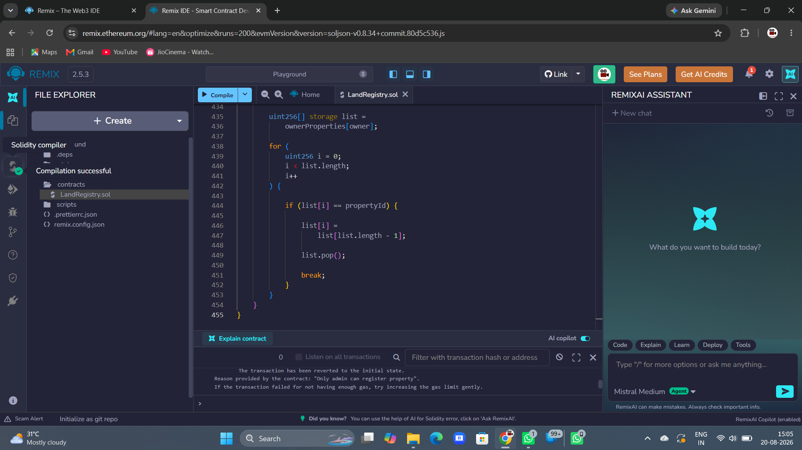

The Solidity smart contract successfully compiles before deployment.

---

## 2. Contract Deployment

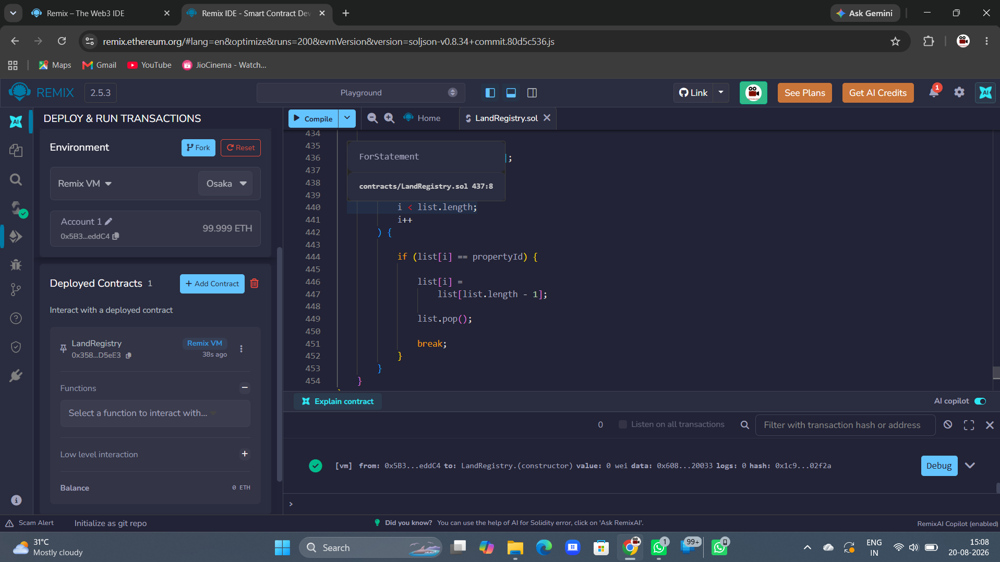

Deployment of the Land Registry smart contract using the administrator account.

---

## 3. Property Registration

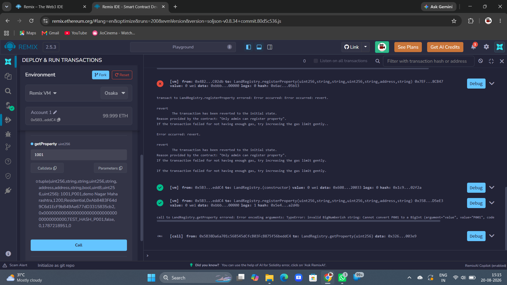

Successful registration of a property by the authorized administrator.

---

## 4. Duplicate Property Protection


The smart contract rejects an attempt to register an existing property again.

---

## 5. Unauthorized Registration Protection


A non-administrator account cannot register a property.

---

## 6. Property Verification

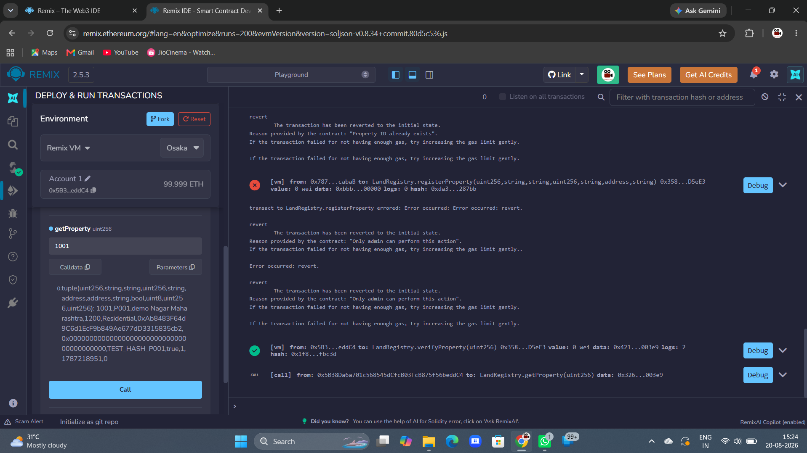

Successful property verification through the smart contract.

---

## 7. Unauthorized Verification Protection


Unauthorized verification attempts are rejected.

---

## 8. Ownership Transfer


Property ownership is transferred to another Ethereum account.

---

## 9. New Owner Confirmation

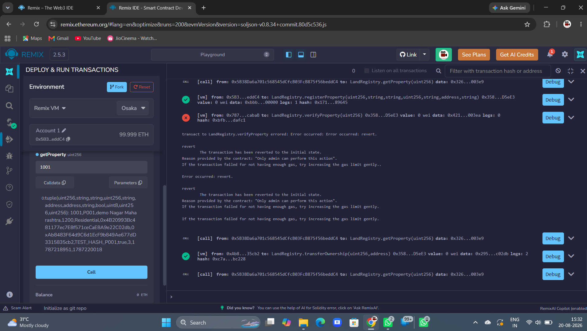

The system confirms the updated owner after the transfer.

---

## 10. Previous Owner Access Rejected


After ownership transfer, the previous owner can no longer perform owner-restricted transfer operations.

---

## 11. Ownership History

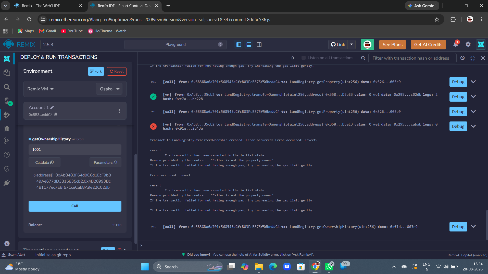

Historical ownership information can be retrieved from the system.

---

## 12. Current Owner

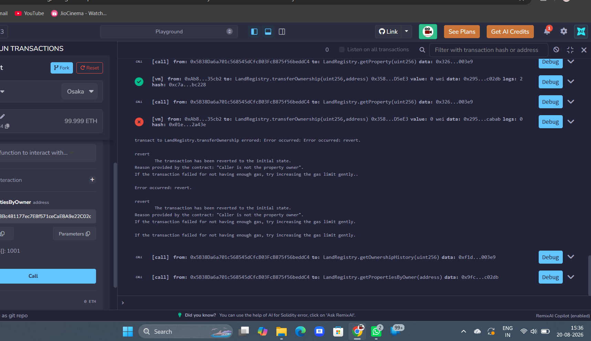

Retrieval of the current property owner's blockchain address.

---

# 🔐 Real SHA-256 Demonstration

## Original Document Hash

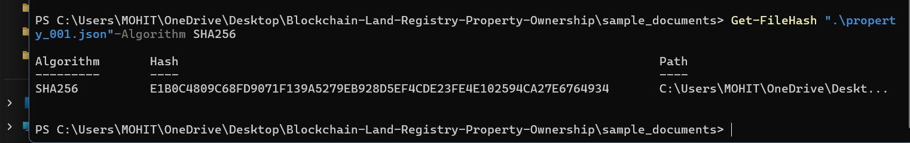

The original property document is hashed using SHA-256.

## Blockchain Hash

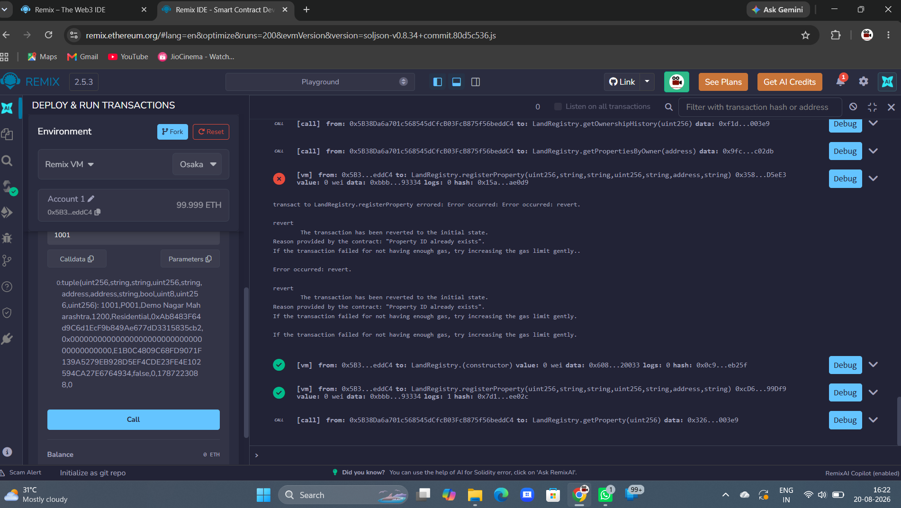

The corresponding document hash is used with the blockchain property record.

---

# ⚙️ Hardhat Testing

## Hardhat Compilation

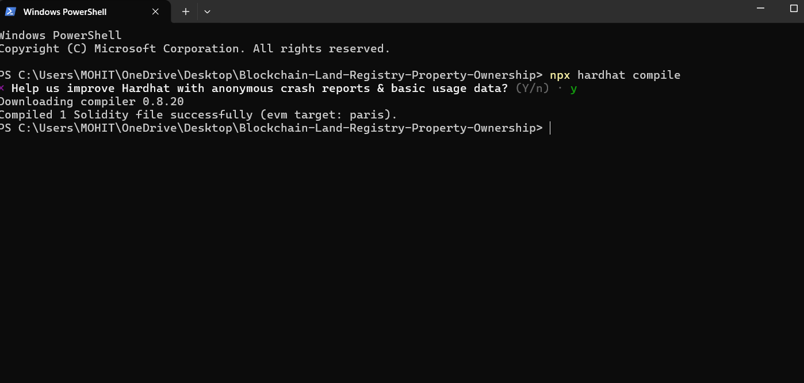

The smart contract is compiled locally using Hardhat.

## Hardhat Deployment

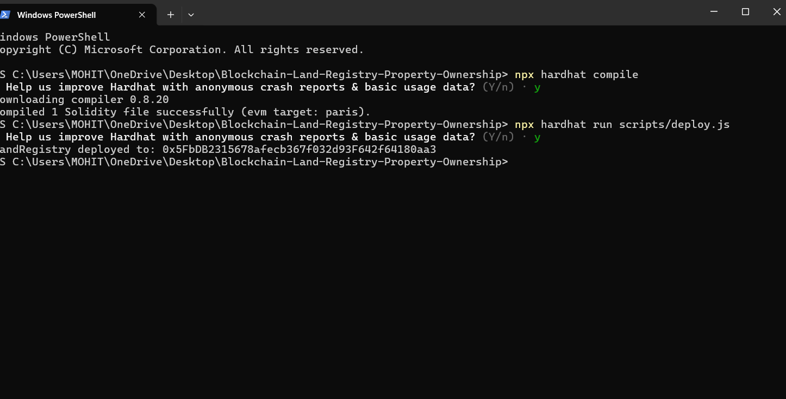

Local deployment demonstrates that the smart contract can run outside Remix.

## Automated Testing

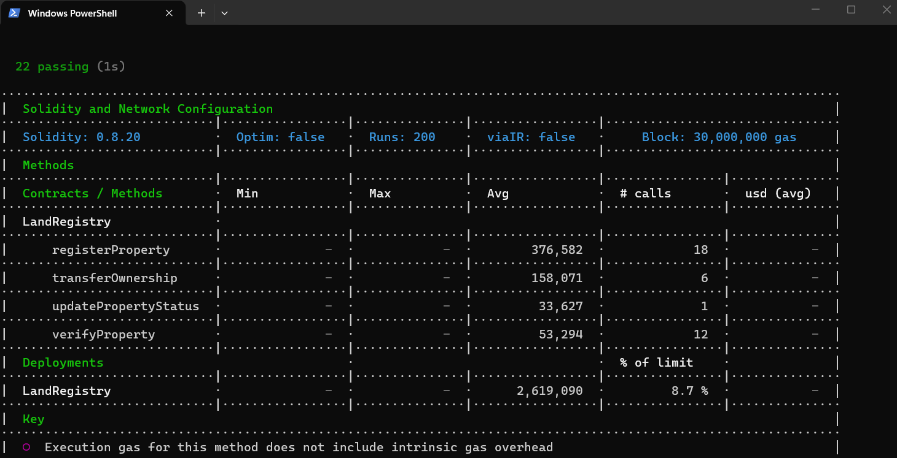

Automated tests validate important smart-contract functionality.

---

# 💻 Installation

## Prerequisites

Install:

- Node.js
- npm
- Git

Check the installation:

```bash
node --version
npm --version
git --version
```

---

## Clone Repository

```bash
git clone <YOUR-GITHUB-REPOSITORY-URL>
```

Enter the project directory:

```bash
cd Blockchain-Land-Registry-Property-Ownership
```

Install dependencies:

```bash
npm install
```

---

# 🔨 Compile the Contract

Run:

```bash
npx hardhat compile
```

A successful compilation confirms that the Solidity contract is valid for the configured Hardhat environment.

---

# 🧪 Run Automated Tests

Run:

```bash
npx hardhat test
```

Hardhat executes the tests contained inside:

```text
test/
```

These tests help validate the behavior of the smart contract automatically.

---

# 🚀 Local Deployment

Start a local Hardhat blockchain:

```bash
npx hardhat node
```

Open another terminal and run:

```bash
npx hardhat run scripts/deploy.js --network localhost
```

The deployment script deploys the Land Registry contract to the local blockchain.

---

# 🌐 Remix IDE Testing

The contract can also be manually tested using Remix IDE.

### Procedure

1. Open Remix IDE.
2. Create `LandRegistry.sol`.
3. Paste the smart-contract code.
4. Open **Solidity Compiler**.
5. Compile the contract.
6. Open **Deploy & Run Transactions**.
7. Select **Remix VM**.
8. Deploy using the administrator account.
9. Register a property.
10. Retrieve the property.
11. Test duplicate registration.
12. Switch accounts and test unauthorized operations.
13. Transfer property ownership.
14. Verify the new owner.
15. Retrieve ownership history.
16. Compare the property document's SHA-256 hash.

---

# 🧪 Example Testing Flow

```text
Deploy Contract
      │
      ▼
Administrator Created
      │
      ▼
Register Property
      │
      ├── Duplicate Registration ──► REJECT
      │
      ▼
Verify Property
      │
      ▼
Generate SHA-256
      │
      ▼
Compare Document Hash
      │
      ▼
Transfer Ownership
      │
      ▼
Confirm New Owner
      │
      ▼
Old Owner Attempts Transfer
      │
      ▼
     REJECT
```

---

# 🛡️ Security Concepts Demonstrated

This project demonstrates several blockchain and cybersecurity concepts:

- Smart-contract access control
- Blockchain-based ownership records
- Cryptographic hashing
- SHA-256 document fingerprints
- Data-integrity verification
- Authorization checks
- Ownership validation
- Duplicate-record prevention
- Transaction traceability
- Smart-contract testing

---

# ⚠️ Current Limitations

This repository is an educational/prototype implementation.

It is **not intended for deployment as an actual government land registry without substantial additional engineering, security auditing, legal integration, identity verification, and infrastructure**.

Current limitations may include:

- No government identity integration
- No production blockchain deployment
- No digital-signature infrastructure
- No legal land-database integration
- Limited frontend/user interface
- No decentralized document-storage integration
- Prototype-level authorization model

---

# 🔮 Future Scope

Future versions could include:

- 🌐 React-based web application
- 🦊 MetaMask wallet integration
- 📦 IPFS document storage
- 🔑 Digital signatures
- 🪪 Aadhaar/e-KYC-style identity integration where legally appropriate
- 🏛️ Government authority verification
- 🗺️ GIS/map-based property visualization
- 📱 Mobile application
- 🔔 Ownership-transfer notifications
- 🧾 QR-based property verification
- 🔍 Blockchain explorer integration
- 🌍 Deployment to an Ethereum-compatible test network
- 🛡️ Professional smart-contract security auditing

---

# 🎯 Learning Outcomes

Through this project, practical experience was gained in:

- Solidity programming
- Ethereum smart contracts
- Blockchain transactions
- Remix IDE
- Hardhat
- JavaScript testing
- SHA-256 hashing
- Smart-contract security
- Access-control implementation
- Git and GitHub
- Technical documentation

---

# 👨‍💻 Author

**Mohit Pimpalkar**

Computer Engineering Student

Areas of Interest:

- 🔐 Cybersecurity
- ⛓️ Blockchain
- ☁️ Cloud Computing
- 🤖 Artificial Intelligence
- 💻 Software Development
- 📊 Data Analytics

---

## ⭐ Support

If you find this educational project useful, consider giving the repository a **⭐ Star**.

---

## 📜 Disclaimer

This project was created for **educational and academic purposes** to demonstrate blockchain-based property ownership management, smart-contract development, and cryptographic document-integrity verification.

It should not be considered a replacement for an official government land-registration system.
